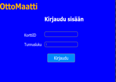
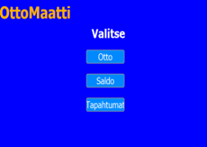

# AtmProject
Atm school project

The basics aims were that the ATM had to operate in such a way that it could sign in users accounts, withdraw money, check the account balance and show transactions from debit card. The goal of our team was also that the ATM must also recognize whether it is a debit card or a combination debit / credit card. 
ATM is controlled from desktop application that connects to back end which handles database. Database has three tables that contains all necessary information needed for ATM 


```
Desktop client
- Qt-creator, QtWidgets
- C++
Rest-Api
- Code igniter 3
- PHP
Database
-MySql
```




*Ui*

The functionality of back end was tested with Postman software. Desktop application was made with Qt-creator using QtWidgets and coded in C++. To work and manage with project source files the project group used GitHub


## Info
* Database script can be found in RestApi/sql

